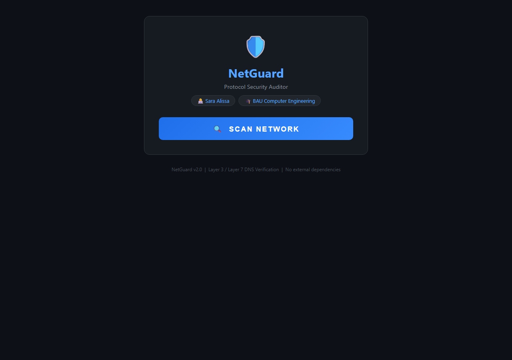

# NetGuard — Protocol Security Auditor

A DNS hijacking detector that compares your local DNS resolver against Google's trusted public DNS (8.8.8.8). If they disagree, your network may be under a man-in-the-middle attack.

Built with pure Python — no external dependencies.

## Screenshot



## How It Works

1. Builds raw DNS query packets from scratch using Python's `struct` module
2. Sends UDP queries to your **local DNS resolver** and **Google's 8.8.8.8**
3. Compares the responses across 4 authoritative domains (`iana.org`, `internic.net`, `ietf.org`, `ripe.net`)
4. If results differ outside the same `/24` subnet → **DNS hijacking detected**

## Getting Started

**Web interface (recommended):**
```bash
python web.py
```
Then open `http://localhost:5000` — click **SCAN NETWORK**.

Or just double-click `Run NetGuard.bat` on Windows.

**Command-line interface:**
```bash
python netguard_scanner.py
```

## Output

| Result | Meaning |
|---|---|
| SECURE | Local DNS matches trusted DNS — network is safe |
| DANGER | DNS responses differ — possible hijacking detected |

## Requirements

- Python 3.x (standard library only — no `pip install` needed)
- Windows / Linux / macOS

## Tech Stack

- Python 3 — raw UDP socket programming, `struct` packet building
- Flask — lightweight web server
- Layer 3 & Layer 7 DNS verification per RFC
- Zero external dependencies
